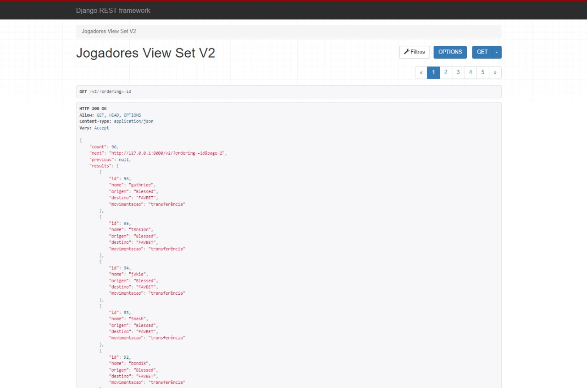

# transferencias-cs

Um projeto back-end desenvolvido para buscar as noticias sobre novas transferencias no cenário de _Counter Strike 2_

O projeto consistem em um sistema de _web scraping_ que coleta as informções do site [HLTV](https://www.hltv.org/transfers), salva os dados em um banco de dados e disponibiliza os dados por meio de API.

Tecnologias utilizadas:
- Python/Django -> servidor web
- Django REST Framework -> desenvolvimento da API
- PostgreSQL -> banco de dados
- BS4, Requests -> web scraping

Neste projeto foi aplicado conceitos de:
- contrução de API no padrão REST
- versionamento de API
- criação de filtros e paginação
- configuração de CORS
- arquitetura MTV

---

